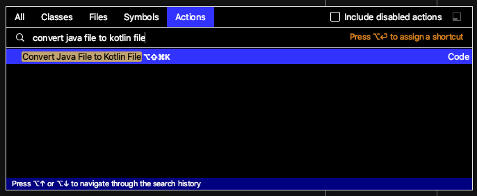
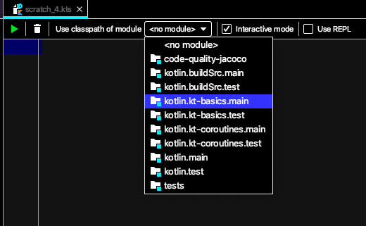
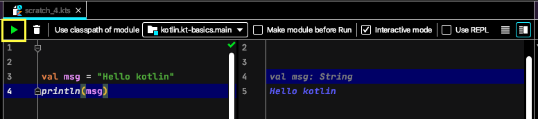
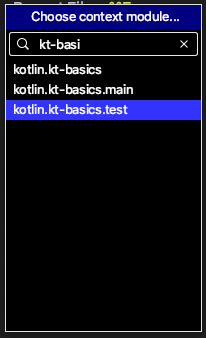
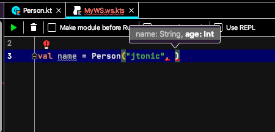
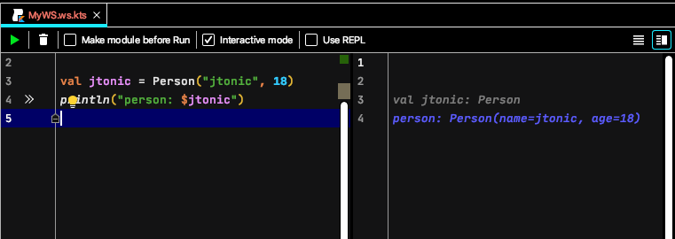

author: Antonel-Ernest Pazargic
title: Kotlin basics
summary: First baby steps into the fascinating Kotlin world
id: kt-basics
categories: jvm
status: draft
feedback link: https://github.com/neculai-stanciu/my-codelabs/issues

# Kotlin basics

## History

Kotlin was started by **Jetbrains** in 2010

It went GA on **February 15, 2016**

**Google IO 2017** - Google announced  Kotlin as an official programming language for Android development

**Google IO 2019** - Kotlin-first (many new APIs and features will be offered first in Kotlin)

## Kotlin strengths

* It is concise, expressive, **toolable**, **interoperable** and pragmatic

* It’s a statically typed programming language

* Inspired by
  * **Scala** (case classes, pattern match)
  * **C#** (extension methods, properties, with and using constructs)
  * **Groovy** (default ‘it’ parameter in lambda expressions)
  * **Swift** (down-casting, subclassing and implementation)
  * **Haskell** (ranges)

* Compile to bytecode and run on **JVM / Android** (compatible with Java 6)

* Can compile to **javascript source code**

* Can be used as **scripting language** (kts extension- Gradle/Kotlin)

* Compiles directly to machine code (**Kotlin/Native**) – in Tech Preview

## Install/Setup

* **Install kotlin on macos using brew**

```sh
  > brew install kotlin

  // test the installation
  > kotlin -version
  > kotlinc -version
```

* **Gradle**

  File `build.gradle`

```groovy
  plugins {
      id 'org.jetbrains.kotlin.jvm' version '1.3.72'
  }
  dependencies {
      implementation "org.jetbrains.kotlin:kotlin-stdlib-jdk8"
  }
```

* **Kotlin DSL for Gradle**

  File `build.gradle.kts`

```kotlin
  plugins {
    kotlin("jvm") version "1.3.72"
  }
  dependencies {
    implementation(kotlin("stdlib-jdk8"))
  }
```

  See further details about kotlin gradle setup [here](https://kotlinlang.org/docs/reference/using-gradle.html)

* **Maven**

  File `pom.xml`

```xml
  <dependencies>
      <dependency>
          <groupId>org.jetbrains.kotlin</groupId>
          <artifactId>kotlin-stdlib-jdk8</artifactId>
          <version>1.3.72</version>
      </dependency>
  </dependencies>

  <build>
    <sourceDirectory>${project.basedir}/src/main/kotlin</sourceDirectory>
    <testSourceDirectory>${project.basedir}/src/test/kotlin</testSourceDirectory>
    <plugins>
      <plugin>
          <groupId>org.jetbrains.kotlin</groupId>
          <artifactId>kotlin-maven-plugin</artifactId>
          <version>${kotlin.version}</version>

          <executions>
              <execution>
                  <id>compile</id>
                  <goals> <goal>compile</goal> </goals>
              </execution>

              <execution>
                  <id>test-compile</id>
                  <goals> <goal>test-compile</goal> </goals>
              </execution>
          </executions>
      </plugin>
  </plugins>
```
  See further details about kotlin maven setup [here](https://kotlinlang.org/docs/reference/using-maven.html)

  **Notes:**
  - Kotlin can be use with ant build tool. See how [here](https://kotlinlang.org/docs/reference/using-ant.html)

## **Hello Kotlin world!**

  There are quite a few ways to create the kotlin application `bootstrap`.

* **Top level main method**

  File `App.kt`

```kotlin
  fun main(vararg args: String) {
    println("Hello Kotlin!")
  }
```

  *Compile and run the application*

```sh
  cd $prj_home/src/main/kotlin
  kotlinc ro/jtonic/handson/kotlin/basics/App.kt AppKt
  kotlin -classpath AppKt.jar ro.jtonic.handson.kotlin.basics.AppKt
```

  *See it on [github](https://github.com/jtonic/tony_software_development_cookbook/commit/fd1ac5fff2eefd1440e1450020294c4e65f016d2)*


* **Top level main (simplified)**

  File `App.kt`

```kotlin
  fun main() {
    println("Hello Kotlin!")
  }
```

  *Compile and run the application*

```sh
  cd $prj_home/src/main/kotlin
  kotlinc ro/jtonic/handson/kotlin/basics/App.kt AppKt
  kotlin -classpath AppKt.jar ro.jtonic.handson.kotlin.basics.AppKt
```

  *See it on [github](https://github.com/jtonic/tony_software_development_cookbook/commit/734dc7bd0d3e1cf53c64bee5c5d2714efab6e35c)*


* **The "java way" with companion object**

File `App.kt`

```kotlin
  class App {

    companion object {

      @JvmStatic
      fun main(vararg args: String) {
        println("Hello Kotlin!")
      }
    }
  }
```

  *Compile and run the application*

```sh
  cd $prj_home/src/main/kotlin
  kotlinc ro/jtonic/handson/kotlin/basics/App.kt AppKt
  kotlin -classpath AppKt.jar ro.jtonic.handson.kotlin.basics.AppKt
```

  *See it on [github](https://github.com/jtonic/tony_software_development_cookbook/commit/bd8668fc965ccbe06d1e90f22f39c29dd233b752)*

* **Main method inside an object (singleton)**

File `App.kt`

```kotlin
object App {

  @JvmStatic
  fun main(vararg args: String) {
    println("Hello Kotlin!")
  }
}
```

  *See it on [github](https://github.com/jtonic/tony_software_development_cookbook/commit/e09ae472dbdf6412ff7ae779604db62e5ef10ea4)*

* **kotlin scripting**

  Create a `main.kts` script file outside the src folder (e.g. $prj_home/scripts/main.kts).

  File `main.kts`

```kotlin
  val message = "Hello Kotlin!"
  println("Hello Kotlin!")
```

  *Run the script*

```sh
  cd $prj_home/scripts
  kotlinc -script main.kts
```

  **Notes:**
  - Jetbrains works on an improved support for kotlin scripting.
  For additional details please consult [KEEP-75](https://github.com/Kotlin/KEEP/blob/master/proposals/scripting-support.md)
  - Kotlin community provides some useful tools which simplifies and extend the out-of-the-box scripting support.
  - For kotlin-based cli I recommend `micronaut` and `picocli`.

  *See it on [github](https://github.com/jtonic/tony_software_development_cookbook/commit/8bc8edc155aee03f3835d80eee38f26e565b0d1b)*


## **Kotlin null safety**
---

* **Not null versus nullable types** (`T and T?`)

```kotlin
  fun print(msg: String?) {}
  fun printPage(msg: String) {}

  print("Hello kotlin")
  print(null)
  printPage(null) // compilation error
```

* **safe call operator** (`?.`)

```kotlin
  "test safe call operator" {
    data class User(val name: String, val address: String)

    var user: User? = null
    user?.address shouldBe null

    user = User("Tony", "Mihai Bravu")
    user?.address shouldBe "Mihai Bravu"
  }
```

  > See it on [github](https://github.com/jtonic/tony_software_development_cookbook/commit/f6240e22b4d192ead921439ca43ded04fc6fb44c)

* **elvis operator** (`?:`)

```kotlin
  "test elvis operator" {

    var address: String? = null
    address ?: "unknown address" shouldBe "unknown address"

    address = "Kotlin Island"
    address shouldBe "Kotlin Island"

  }
```

  > See it on [github](https://github.com/jtonic/tony_software_development_cookbook/commit/afade3bcd15793ff398c2b39c4c288df8fd26cbf)

* **safe cast operator** (`as?`)

```kotlin
  "test safe cast operator" {

      val jtonic = User("jtonic", "Mihai Bravu") as Any
      val tony = Person("Tony", 18) as Any

      (jtonic as? User) shouldNotBe null
      (tony as? User) shouldBe null

      val jtonicUserAddress = (jtonic as? User)?.address
      val tonyUserAddress = (tony as? User)?.address

      jtonicUserAddress shouldBe "Mihai Bravu"
      tonyUserAddress shouldBe null

  }
```
* **Not null assertion** (`!!`)

```kotlin

    "test not null assertion" {

      fun length(s: String?): Int {
        val notNullString: String = s!! //Kotlin.KotlinNullPointerException
        return notNullString.length
      }

      length("jtonic") shouldBe 6

      shouldThrow<NullPointerException> {
        length(null)
      }

      shouldThrow<KotlinNullPointerException> {
        length(null)
      }

    }
```

  **Notes:**
  - throws `KotlinNullPointerException` which extends `java.lang.NullPointerException`
  - it is thrown at assignment site
  - it should be avoided in application written entirely in kotlin. It is used when calling java API from kotlin

  > See it on [github](https://github.com/jtonic/tony_software_development_cookbook/commit/4f88d00e359ce3573051aa68bce14e2999992d99)

## Kotlin plugins for IntelliJ Idea

  **Notes:**
  - The information presented in this section is based on **IntelliJ Idea Ultimate 2020.1** and **kotlin plugin 1.3.72**.

* **Install Kotlin Idea plugin**

  - Select `Help | Find Actions...` from main menu  (or press `cmd-shift-a`)
  - Type `plugins` and hit `Enter`
  - Enable the kotlin plugin by following the steps highlighted in the image below

  

* **Convert from java to kotlin**

  - Open the java file to convert, or just select it in the project tool window
  - Select `Help | Find Actions...` from main menu  (or press cmd-shift-a)
  - Type `convert java file to kotlin file` and hit Enter

  

  The following java file

```java
public class Person {

  private String name;
  private int age;

  // constructor, getter and setters (28 lines of code)
}
```
  gets converted to the following kotlin

```kotlin
  class Person(var name: String, var age: Int)
```

  > See it on [github](https://github.com/jtonic/tony_software_development_cookbook/commit/c0fab8fd23cc072920541d2920b8f5e80e24165b)

* **Decompile kotlin to java**

  Doesn't work any longer with 2020.1 and kotlin 1.3.71 :(

* **Kotlin scratch file**

  Scratch files is an amazing idea features.

  It allows development by experimenting.

  Kotlin plugin contributes to the scratch feature feature.

  How to:
  - Open `Find Action...`
  - Type `scratch file`

  

  - Type `kotlin`

  

  - Select a project module classpath

  

  - Run the scratch file kotlin code, when the interactive is checked out

  

  **Notes:**
  - A scratch file can be renamed. One can give it a meaningful name.
  - A scratch file has IDE visibility. It can be seen in every project.

* **Kotlin REPL**

  How to:
  - Open `Find Action...`
  - Type `kotlin REPL`

  

  - Choose a project module

  

  - Start coding.

    For execution press `cmd-enter`

  

  - Show quick documentation in REPL

  


  **Notes:**
  - (Almost) all supports in the IDE editor works in REPL as well:
    - autocomplete,
    - automatic imports,
    - compilation errors
    - quick source
    - quick documentation
    - and much more....

* **Kotlin worksheet**

  How to:
  - Open `Find Action...`
  - Type `kotlin REPL`

  

  - Start coding

  See Idea inspection and hint in action.

  

  - Click the green arrow button to execute the code if the interactive mode is off.

  

  **Notes:**

  There are some similarities between the kotlin scratch file and kotlin worksheet.

  The worksheet:
  - file is stored in project, it can be versioned.
  - has kts file extension (it is a kotlin script file)
  - requires the `kotlin-script-runtime` in project classpath. If it is not then Idea offers to add it.


## **My favorite kotlin features**
---

* **Pattern matching** (`when`)

```kotlin
    "test pattern matching with when (1)" {

        val no = 7

        val day: String = when(no) {
          6, 7 -> "weekend"
          else -> "week day"
        }

      day shouldBe "weekend"
    }
```

```kotlin
    "test pattern matching with when (2)" {

      val person = Person("Tony", 18) as Any

      val personInfo: String = when(person) {
        is String -> person
        is Person -> person.name  //smart cast
        else -> person.toString()
      }
      personInfo shouldBe "Tony"
    }
```

  See [doc](https://kotlinlang.org/docs/reference/whatsnew13.html#capturing-when-subject-in-a-variable)

  *See it on [github](https://github.com/jtonic/tony_software_development_cookbook/commit/1d76432b5c381260f1ec98a911c0576baa80242b)*

* **Smart cast**

  - In if, when and other kt constructs

```kotlin
    "test smart cast" {

      val person = Person("Tony", 18) as Any

      val personInfo = if(person is Person) {
        person.name
      } else {
        person.toString()
      }

      personInfo shouldBe "Tony"
    }
```
  *See it on [github]()*

* **Data classes**

  - provides getters/setters, all args constructor, equals/hashCode, toString, copy, destruction

```java
    public class Survey {

      private String id;
      private String name;
      private String description;
      private String category;
      // 82 lines of code (getters/setters/hashCode...)
```

```kotlin
  data class Survey(var id: String, var name: String, var description: String, var category: String)
```
  *See it on [github](https://github.com/jtonic/tony_software_development_cookbook/commit/3c1783fbc128e3d5ecec0a4395ad913be1c76289)*


* **Expressions (almost) everywhere**

  - if, then, catch, generators are all expressions.

```kotlin
    "test expression is almost everywhere (try/catch)" {

      val age = try {
        Integer.parseInt("tony's age")
      } catch (e: Exception) {
        90
      }

      age shouldBe 90
    }
```
  *See it on [github](https://github.com/jtonic/tony_software_development_cookbook/commit/f9f3610f42f952dd50c3456d9a29afbf1a88e2ae)*


* **Extension methods/properties**

```kotlin
    "test extension method" {

      fun Employee.fullName() = "${this.firstName} ${this.lastName}"

      val tony = Employee("Antonel", "Pazargic", 18)

      tony.fullName() shouldBe "Antonel Pazargic"
    }
```
```kotlin

    val Employee.fullName: String
          get() =
            "${this.firstName} ${this.lastName}"

    "test extension property" {

      val tony = Employee("Antonel", "Pazargic", 18)

      tony.fullName shouldBe "Antonel Pazargic"
    }
```
  *See it on github [here](https://github.com/jtonic/tony_software_development_cookbook/commit/75e094fcff2b9a5c0a6b428f88a54c3af0041cf3) and [here](https://github.com/jtonic/tony_software_development_cookbook/commit/29eb9f721b4e0e256b4c49040945ff7d72e21e30)*


* **(Multi line) string interpolation**

```kotlin
  // code here
```
  *See it on [github]()*


* **Type inference**

```kotlin
  // val var
  // fun sum(a: Int, b: Int) = a + b
```
  *See it on [github]()*


* **Scope methods (`run`, `let`, `with`, `apply`, `also`)**

```kotlin
  // code here
```
  *See it on [github]()*


* **Reified types and inline methods**

```kotlin
  // if () then else
  // when
  // try catch
```
  *See it on [github]()*

* **Immutable/mutable collections**

```kotlin
  // if () then else
  // when
  // try catch
```
  *See it on [github]()*

* **Aliases**

```kotlin
  // if () then else
  // when
  // try catch
```
  *See it on [github]()*

* **Lambda with receiver**

```kotlin
  // if () then else
  // when
  // try catch
```
  *See it on [github]()*


* **Nested functions**

```kotlin
  // if () then else
  // when
  // try catch
```
  *See it on [github]()*


* **apply**

```kotlin
  // if () then else
  // when
  // try catch
```
  *See it on [github]()*

* **lateinit var**

```kotlin
  // if () then else
  // when
  // try catch
```
  *See it on [github]()*

* **named and default parameters**

```kotlin
  //
```
  *See it on [github]()*

* **Sealed classes (ADT)**

```kotlin
  //
```
  *See it on [github]()*


* **Inline classes**

```kotlin
  //
```
  *See it on [github]()*


## What’s next?

**Options**

  1. Java/Kotlin interoperability
  2. OOP in Kotlin
  3. Design patterns in kotlin
  4. Kotlin collections
  5. Scripting in kotlin (cli)
  6. SpringBoot and Kotlin
  7. Reactive programming in kotlin
  8. Kotlin coroutines
  9. Functional programming in kotlin
  10. Kotlin 1.4
  11. Micronaut and Kotlin
  12. Kotlin JS
  13. Kotlin Multi Platform Programming
  14. Kotlin DSL
