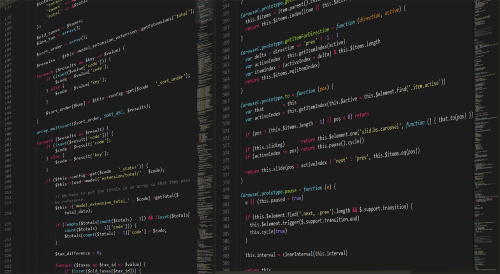

<!-- Firstly we have to inform users what the document is about: -->
author: Stanciu Neculai
title: Setup micronaut
summary: In this moment Micronaut CLI is the way to go to generate a micronaut project. In this tutorial we will install this tool and create a
simple project.
id: setup-micronaut
categories: web
status: draft
feedback link: https://github.com/neculai-stanciu/my-codelabs/issues

# Setup micronaut CLI
Duration: 30:00

## Build/Install the CLI
Duration: 20:00



### Install with Sdkman

In order to install Micronaut, run following command:

```bash
$ sdk install micronaut
```

You can also specify the version to the sdk install command.

```bash
$ sdk install micronaut 1.3.4
```

You can find more information about SDKMAN usage on the [SDKMAN Docs](http://sdkman.io/usage)

You should now be able to run the Micronaut CLI.

```bash
$ mn
| Starting interactive mode...
| Enter a command name to run. Use TAB for completion:
mn>
```
### Install with Homebrew

In order to install Micronaut, run following command:

```bash
$ brew install micronaut
```
You can find more information about Homebrew usage on their [homepage](https://brew.sh/).

###  Install through Binary on Windows

- Download the latest binary from [Micronaut Website](http://micronaut.io/download.html)
- Extract the binary to appropriate location (For example: C:\micronaut)
- Create an environment variable MICRONAUT_HOME which points to the installation directory i.e. C:\micronaut
- Update the PATH environment variable, append %MICRONAUT_HOME%\bin.

Negative
: If you are using an internal repository please make sure to mirror *jcenter* repository

## Creating a Server Application

```bash
 mn create-app hello-world
```

Positive
: You can supply --build maven if you wish to create a Maven based build instead

The previous command will create a new Java application in a directory called hello-world featuring a Gradle build. The application can be run with ./gradlew run:

```bash
$ ./gradlew run
> Task :run
[main] INFO  io.micronaut.runtime.Micronaut - Startup completed in 972ms. Server Running: http://localhost:28933
```

If you have created a Maven based project, use ./mvnw compile exec:exec instead.

By default the Micronaut HTTP server is configured to run on port 8080. See the section Running Server on a Specific Port in the user guide for more options.

In order to create a service that responds to "Hello World" you first need a controller. The following is an example of a controller:

```java
import io.micronaut.http.MediaType;
import io.micronaut.http.annotation.Controller;
import io.micronaut.http.annotation.Get;

@Controller("/hello") //#1
public class HelloController {

    @Get(produces = MediaType.TEXT_PLAIN) //#2
    public String index() {
        return "Hello World"; //#3
    }
}
```

1. The class is defined as a controller with the @Controller annotation mapped to the path /hello
2. The @Get annotation is used to map the index method to all requests that use an HTTP GET
3. A String "Hello World" is returned as the result

If you start the application and send a request to the /hello URI then the text "Hello World" is returned:

```bash
$ curl http://localhost:8080/hello
Hello World
```
